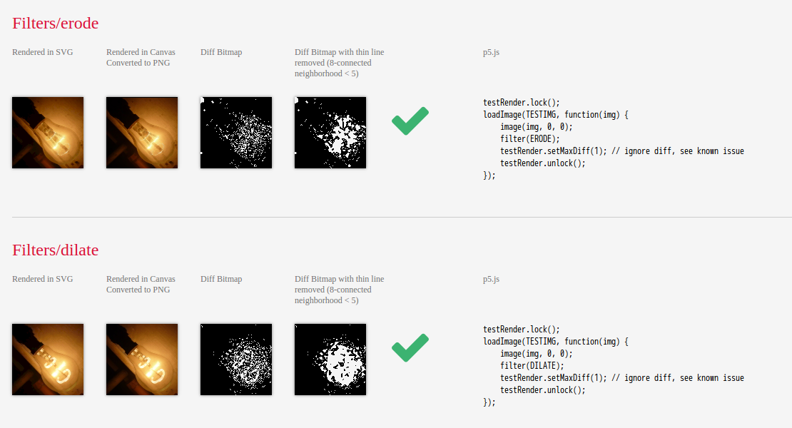

# p5.SVG Overview

The main goal of p5.SVG is to provide a SVG runtime for p5.js,
so that we can draw using p5's powerful API in \<svg\>, save things to svg file
and manipulating existing SVG file without rasterization.

p5.SVG consists of 2 parts:

- p5.RendererSVG

    Allow drawing using p5.js API on top of a \<svg\> element.

- SVGElement API

    This is the API designed for manipulating SVG.
    It's a class extending p5.Element, but provides more API for SVG.

## So, how is SVG Renderer different than Canvas2D Renderer

The major difference is that SVG Renderer is based on SVG Document Object Model
while Canvas 2D Renderer is based on pixels.
Therefore, the performance may not be as good as canvas.
However, being DOM-based also means that it is possible to modify what's already drawn without drawing new elements. This can be done using the SVGElement API.

Note that not all drawing results are exactly same in pixel-level.

For example, the round rects below are almost same, but there are some pixels different.

As for filters, gray(), invert(), threshold(), opaque() did have same behavior as Canvas2D Renderer. But blur(), erode(), dilate() didn't.

To implement blur, I use feGaussianBlur, which is different from Processing's blur.

As for erode() and dilate(), they were implemnted using feOffset and feBlend. So, the result is not exactly same.

You can view all the pixels based diff on the [online tests](http://zenozeng.github.io/p5.js-svg/test/).

## [TODO] Getting Started

See [Getting Started with p5.SVG](./getting-started.md).

## [TODO] SVGElement API

## [TODO] SVGFilter API

Custom SVG Filter using `registerSVGFilter` might be added in next release of p5.svg (v0.5.0).

## Browser Compatibility

p5.SVG@0.4.2 was tested and should work on:

- Firefox 40.0 on Linux
- Google Chrome 44 on Linux

- Google Chrome 43 on Android 4.4.4

- Safari 8.0.7 on Mac (Thanks @fnlctrl)

- Safari on iOS 8 (Thanks @chiyolyn)

p5.SVG@0.4.2 may not work on IE10. There are still [some issues](https://github.com/zenozeng/p5.js-svg/issues/122).

As for Microsoft Edge, p5.SVG@0.4.2 basically works, but there are [issues with Filters/posterize and Filters/erode](https://github.com/zenozeng/p5.js-svg/issues/128).

## [TODO] How it works

The SVG based canvas API wrapper is powered by [gliffy's canvas2svg](https://github.com/gliffy/canvas2svg) with [patches](https://github.com/gliffy/canvas2svg/issues?utf8=%E2%9C%93&q=author%3Azenozeng+). I hope basically we can write once and run on both canvas and svg. So we can use canvas for perfermence and use svg for exporting or oop api. Also, I hope that we could only maintain the 2d shapes in canvas API, and let p5.js-svg automatically render it in SVG.

这里也讲讲 GC。

## Known issue

- blendMode is not implemented yet.

- [P3D is not supported yet](https://github.com/zenozeng/p5.js-svg/issues/51)

## [TODO] Tests and Issues

I write a lot tests

https://github.com/zenozeng/p5.js-svg/tree/master/test/unit

## Unit Test

http://zenozeng.github.io/p5.js-svg/test/

### Coverage Report

#### Chrome

http://zenozeng.github.io/p5.js-svg-test-reports/coverage/chrome/

#### Firefox

http://zenozeng.github.io/p5.js-svg-test-reports/coverage/iceweasel/
